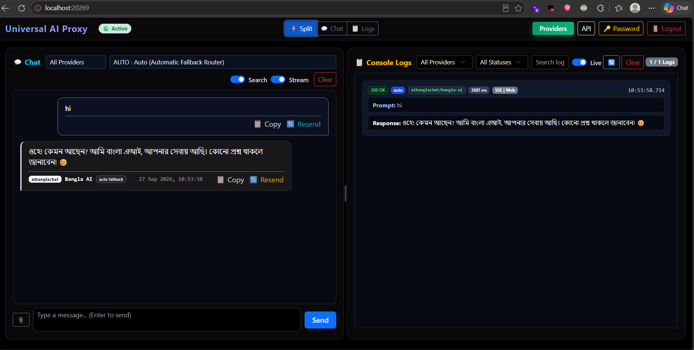

# ⚡ Universal AI API Proxy

[](https://nodejs.org/)
[](https://expressjs.com/)
[](https://platform.openai.com/docs/api-reference)
[](./test/e2e.js)
[](./package.json)

A production-ready, unified **OpenAI-compatible REST API proxy server** that fronts multiple free AI chat providers alongside your own custom API endpoints. Features automated multi-provider failover routing, custom drag-and-drop combo sequence builders, an interactive dual-pane web UI with live logs, authentication, offline-served static assets, and a Windows System Tray background launcher.



---

## 🌟 Key Features

- 🔌 **OpenAI API Compatible**: Drop-in replacement for OpenAI SDKs (`POST /v1/chat/completions`) supporting text, streaming (SSE), multimodal base64 image inputs, and real-time web search toggle.
- 🎨 **Modern Cyberpunk AI Web UI (`/`)**: Resizable split-pane layout (Chat + Real-time Logs), view mode switcher (`Split` / `Chat` / `Logs`), Select2 real-time search filters, and SweetAlert2 dark notifications.
- 🔒 **Built-in Authentication & Security**: Password-protected login page (`/login`), salted PBKDF2 password hashing, session tokens, password management, and optional `ADMIN_KEY` protection for mutating endpoints.
- 🔀 **Smart Auto Failover & Combo Routers**: Configurable drag-and-drop model failover order (`auto`) and custom named combo routers (`combo/<id>`) with automated 30s failure cooldowns.
- 📦 **Offline & Self-Contained**: 100% local static assets (`/assets/css`, `/assets/js`) with zero dependency on external CDNs.
- 🖥️ **Windows System Tray Launcher**: Silent background launch via `start.vbs` or `start.cmd`, system tray icon (`app.ico`), auto-start on boot, popup status notification, and tray control menu.
- 🚀 **12+ Preset API Compatibility Templates**: Instant setup for **OpenRouter**, **Ollama**, **Groq**, **DeepSeek**, **Mistral**, **xAI Grok**, **OpenCode Zen**, **Poolside**, **BazaarLink**, **Kilo Gateway**, **Google Gemini**, and **Anthropic Claude** with direct API key helper links.

---

## 🚀 Quick Start

### 1. Installation & Standard Launch

```bash
# Clone repository and install dependencies
git clone https://github.com/mahediazad/universal-proxy.git
cd universal-proxy
npm install

# Start the server
npm start
```

Access the application in your browser:
- **Web UI & Live Logs**: [http://localhost:3000/](http://localhost:3000/)
- **API Documentation**: [http://localhost:3000/docs](http://localhost:3000/docs)
- **Login Page**: [http://localhost:3000/login](http://localhost:3000/login) *(Default Admin Password: `password`)*

### 2. Double-Click Windows System Tray Launch

For a silent background launch on Windows with a System Tray icon:
1. Double-click **`start.vbs`** or **`start.cmd`** in File Explorer.
2. The proxy server runs silently in the background.
3. A popup notification will confirm status and offer to open the browser.
4. Right-click the system tray icon anytime to:
   - 💬 **Open Chat**: Open web UI on active port.
   - ⚙️ **Auto Start Enable / Disable**: Toggle Windows startup registry.
   - 📞 **Developers Contact**: Visit developer portfolio.
   - ❌ **Quit**: Gracefully stop background processes.

---

## ⚙️ Configuration (`.env`)

Create a `.env` file in the project root to customize proxy settings:

```env
# Server Port (Default: 3000)
PORT=3000

# Optional: Custom Chrome binary path for headless browser providers
CHROME_PATH=C:\Program Files\Google\Chrome\Application\chrome.exe

# Optional: Admin Key protection for mutating API endpoints
ADMIN_KEY=your_secret_admin_key

# Optional: Disable authentication for local testing
DISABLE_AUTH=false
```

---

## 🧪 Testing

Run the automated end-to-end test suite (spins up mock upstreams on port 3999):

```bash
npm test
```

> **Test Suite**: 95/95 test cases passing covering endpoints, authentication, custom provider CRUD, combo failover routing, alias rewrites, request limits, and fake DOM script rendering.

---

## 🤖 Supported Built-in Providers & Models

| Provider ID | Provider Name | Transport / Type | Models / Alias | Notes |
|---|---|---|---|---|
| `auto` | Auto Failover Router | Internal | `auto` | Walks your configured failover sequence; skips failures for 30s |
| `combo/` | Combo Routers | Internal | `combo/<id>` | Custom drag-and-drop failover sequences |
| `freemodels` | FreeModels Chat | HTTP / SSE | `claude-sonnet-5`, `claude-fable-5`, `claude-fable-5.1`, `gpt-5.6-sol`, `gpt-5.6-terra`, `glm-5.2`, `kimi-k3` | Zero config |
| `duckai` | DuckDuckGo AI | Chrome Driver | `gpt-5.6-luna`, `gpt-5.4-mini`, `claude-haiku-4-5`, `mistral-small-2603` | VQD challenge solver |
| `unlimitedai` | UnlimitedAI Chat | Chrome Driver | `chatgpt`, `gemini`, `deepseek`, `claude`, `grok`, `perplexity`, `meta`, `qwen` | Multi-engine browser backend |
| `aichatting` | AIChatting | HTTP / SSE | `gpt-5.6-luna`, `ask-ai` | HTTP API |
| `aibanglachat` | AiBanglaChat | HTTP API | `bangla-ai`, `bangla-ai-web` | `-web` variant enables search |
| `eye2ai` | Eye2.ai Multi-LLM | Socket.io Stream | `chatgpt`, `gemini`, `qwen`, `mistral`, `deepseek`, `ai21`, `amazon-nova`, `glm`, `smart`, `cohere`, `minimax`, `gemma`, `mercury` | WebSockets relay |
| `custom` | Custom Providers | User Configured | `<providerId>/<modelId>` | OpenAI, Gemini, Claude, OpenRouter, Groq, Ollama, DeepSeek, etc. |

---

## 📚 API Endpoints Overview

| Method | Path | Description |
|---|---|---|
| `GET` | `/` | Web UI: Chat + Live Console Logs (resizable split view) |
| `GET` | `/docs` | Full-width interactive API documentation |
| `GET` | `/login` | Admin authentication login page |
| `GET` | `/health` | Server health check and browser driver status |
| `POST` | `/v1/auth/login` | Authenticate password and receive session token |
| `POST` | `/v1/auth/logout` | Revoke active session token |
| `POST` | `/v1/auth/change-password` | Update admin password |
| `GET` | `/v1/models` | List all available models across all providers |
| `POST` | `/v1/chat/completions` | Standard OpenAI-compatible Chat Completion endpoint |
| `GET` | `/v1/logs?since=<id>` | Incremental sync of in-memory provider request logs |
| `DELETE` | `/v1/logs` | Clear in-memory request log buffer |
| `GET` | `/v1/custom-providers` | List configured custom API providers |
| `POST` | `/v1/custom-providers` | Create or update a custom API provider |
| `DELETE` | `/v1/custom-providers/:id` | Remove a custom API provider |
| `POST` | `/v1/custom-providers/:id/refresh` | Auto-discover models from provider endpoint |
| `GET` | `/v1/combos` | List custom combo routers and auto sequence |
| `POST` | `/v1/combos` | Create or update a custom combo router |
| `DELETE` | `/v1/combos/:id` | Remove a custom combo router |
| `POST` | `/v1/combos/auto-sequence` | Set global `auto` failover sequence priority |

---

## 💻 SDK & Code Examples

### 1. Python OpenAI SDK Multimodal & Search Example

```python
from openai import OpenAI

client = OpenAI(
    base_url="http://localhost:3000/v1",
    api_key="not-needed"  # Or pass session token / ADMIN_KEY
)

response = client.chat.completions.create(
    model="auto",
    messages=[
        {
            "role": "user",
            "content": [
                {"type": "text", "text": "Analyze image and search web for current details"},
                {"type": "image_url", "image_url": {"url": "data:image/jpeg;base64,..."}}
            ]
        }
    ],
    extra_body={"webSearch": True}
)

print("Result:", response.choices[0].message.content)
```

### 2. cURL Chat Completion Request

```bash
curl -X POST http://localhost:3000/v1/chat/completions \
  -H "Content-Type: application/json" \
  -d '{
    "model": "freemodels/claude-sonnet-5",
    "stream": true,
    "webSearch": true,
    "messages": [
      { "role": "user", "content": "Explain quantum computing in simple terms." }
    ]
  }'
```

---

## 📂 Project Architecture

```
universal-proxy/
├── server.js              # Express 5 app, routing table, UI & docs HTML rendering
├── assets/                # Self-contained offline static assets
│   ├── css/               # Bootstrap 5.3.3 & SweetAlert2 Dark CSS
│   └── js/                # Bootstrap 5.3.3 & SweetAlert2 Bundle JS
├── lib/
│   ├── auth.js            # Password hashing (PBKDF2), session management & route auth
│   ├── net.js             # fetchWithTimeout: connection deadlines & stream timeouts
│   ├── sse.js             # OpenAI-compatible SSE streaming & JSON format helpers
│   ├── browser.js         # Shared headless-Chrome driver with process auto-restart
│   └── logger.js          # Ring buffer memory logger for /v1/logs
├── providers/
│   ├── auto.js            # Auto failover router with provider attempt timeouts & 30s cooldown
│   ├── combos.js          # Combo router persistence & CRUD (atomic JSON writes, mtime cache)
│   ├── custom.js          # Custom provider passthrough (OpenAI, Gemini, Claude, OpenRouter, etc.)
│   ├── freemodels.js      # HTTP SSE provider
│   ├── aichatting.js      # HTTP SSE provider
│   ├── aibanglachat.js    # HTTP provider
│   ├── eye2ai.js          # WebSocket Socket.io provider
│   ├── unlimitedai.js     # Headless Chrome provider
│   └── duckai.js          # Headless Chrome provider with VQD solver
├── start-tray.ps1         # Windows System Tray launcher & server manager
├── build-icon.ps1         # Custom System Tray app icon generator
├── app.ico                # Project icon asset
├── start.vbs              # Silent VBScript launcher for start-tray.ps1
├── start.cmd              # Windows Batch launcher
├── custom-providers.json  # Persisted custom API providers
├── combos.json            # Persisted combo routers & auto sequence
├── auth.json              # Persisted admin password hash
└── test/
    └── e2e.js             # Complete E2E test suite (95 tests)
```

---

## 👨‍💻 Developer & Support

Developed & Maintained by **Mahedi Azad**.

- **Developer Portfolio**: [http://mahediazad.com](http://mahediazad.com)
- **Bug Reports & Issues**: [https://github.com/anomalyco/antigravity/issues](https://github.com/anomalyco/antigravity/issues)

---

## 📜 License

This project is licensed under the [ISC License](./package.json).
